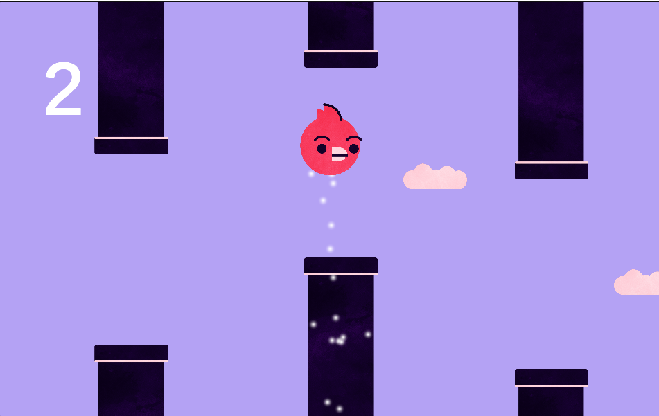
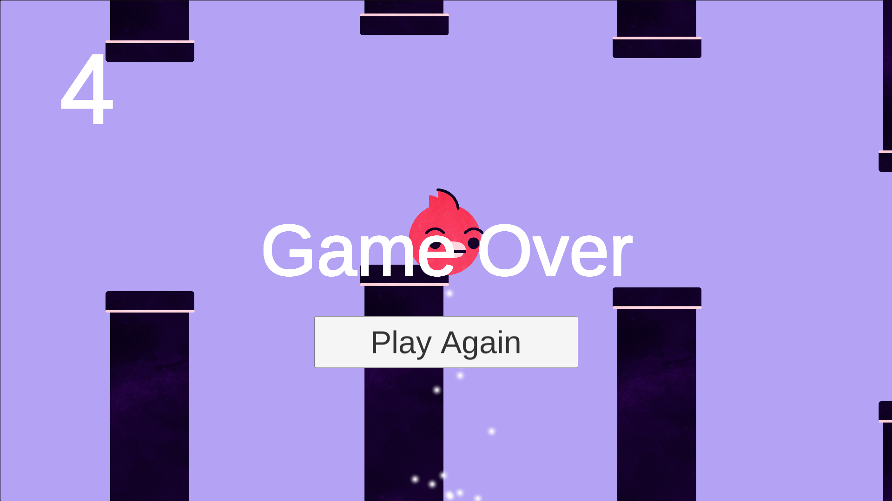

# floppy-bird

A high-contrast 2D arcade survival runner built in Unity 6 and deployed for the web. Control the avian vessel through procedurally spaced obstacles, balance gravity with downward thrust, and collect bonus loot.

Play live on [itch.io](https://djdadaisdanger.itch.io/floppy-bird).

---

## Gameplay

 |
 

---

## Controls

* **Thrust / Flap:** `Space`, `Left Mouse Click`, or `Screen Tap` (mobile)
* **Goal:** Thread through vertical pipe gaps without colliding with obstacles or screen boundaries.

### Scoring
* **Pass Obstacle:** +1 point
* **Collect Floating Cloud:** +5 bonus points

---

## Key Features

* **Multi-Input Support:** Unified handling for keyboard, mouse clicks, and touch gestures.
* **Dynamic Bonus System:** Configurable probability-based collectible spawner (`BonusSpawner.cs`) that offsets collectible heights within pipe gaps.
* **Particle System:** Custom directional thruster exhaust layered behind the player sprite.
* **Optimized WebGL Pipeline:** Tuned build profiles for low-latency web browser execution.

---

## Tech Stack

* **Engine:** Unity 6 (6000.5.10f1)
* **Language:** C#
* **Physics:** 2D Rigidbody & Trigger Colliders
* **Target Platform:** WebGL (HTML5 Canvas)

---

## Getting Started

### Prerequisites
* Unity 6 LTS (with **WebGL Build Support** installed via Unity Hub)
* Git

### Installation & Local Setup

1. **Clone the repository:**
   ```bash
   git clone [https://github.com/DJDadaisdanger/floppy-bird.git](https://github.com/DJDadaisdanger/floppy-bird.git)
   cd floppy-bird


2. **Open in Unity:**
* Open Unity Hub.
* Click **Add** > **Add project from disk**.
* Select the repository folder.
* Open the project with Unity 6.


3. **Run the Game:**
* Navigate to `Assets/Scenes/GameScreen.unity`.
* Press the **Play** button in the Unity Editor.


---

## Project Architecture

```text
Assets/
├── Prefabs/
│   ├── Pipe.prefab          # Paired pipe obstacle with nested trigger and spawner
│   └── cloud.prefab         # Bonus collectible with trigger logic
├── Scenes/
│   └── GameScreen.unity     # Core gameplay scene
├── Scripts/
│   ├── BirdScript.cs        # Input handling, thrust physics, and trigger detection
│   ├── PipeSpawnerScript.cs # Obstacle instantiation and lifetime handling
│   ├── BonusSpawner.cs      # Probability roll and local Y-offset randomization
│   └── LogicScript.cs       # Score management, UI triggers, and scene restarts
└── Sprites/                 # Custom high-contrast character and environment assets

```

---

## Building for WebGL

1. Go to **File > Build Profiles**.
2. Select **Web** (Desktop - Release profile) and ensure `GameScreen.unity` is included.
3. Click **Build** and choose an export directory outside the project root.
4. Compress the contents of the output folder (`index.html`, `Build/`, `TemplateData/`) directly into a `.zip` archive for hosting on itch.io or GitHub Pages.

---

